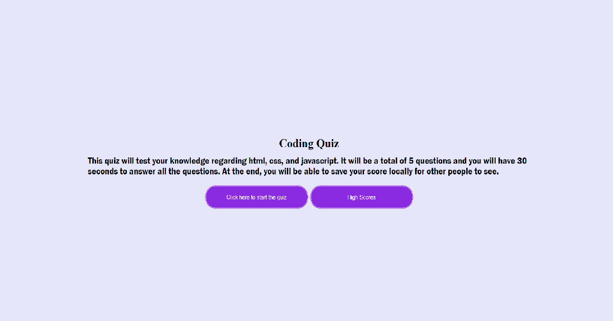
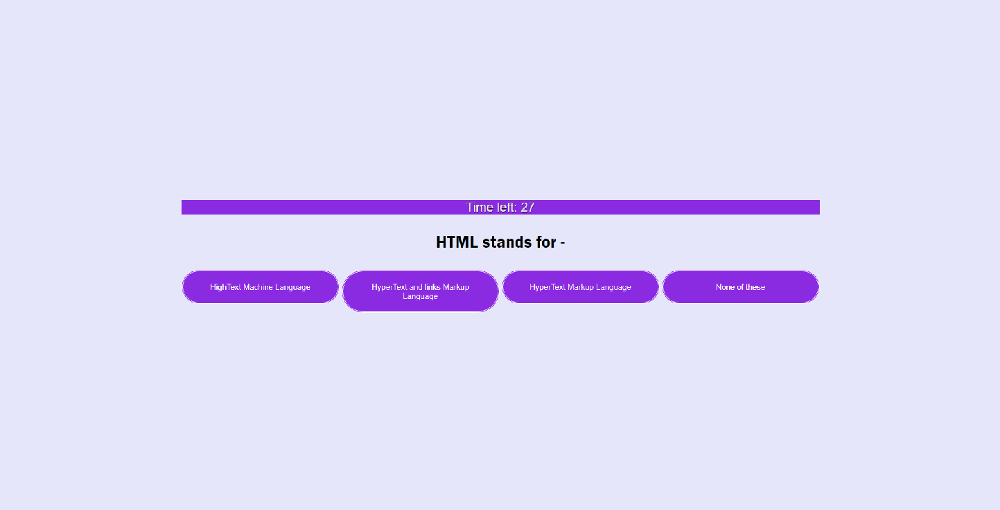
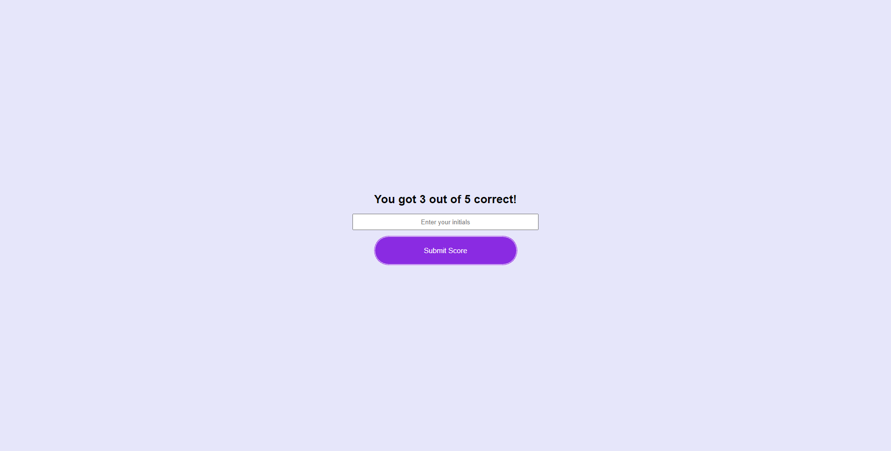
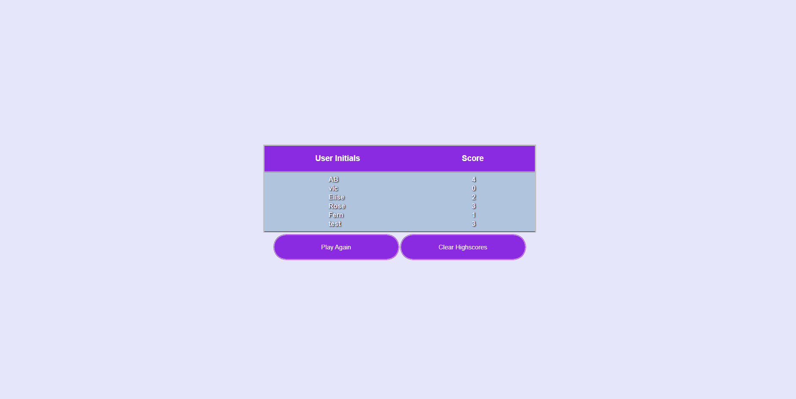

This is a quiz based on html, css, js. There is also a leaderboard to compare to your friends. There is a main menu that can redirect you to see the current highscores, or to just start the quiz. Starting the quiz will prompt a question with answer choices. A window popup will let you know if you were right/wrong. There is a total of five questions with a time limit of 30 seconds. At the end (or when your time runs out), you are able to put your name to save your highscore and compare to other people who have played. 

User Story:
AS A coding boot camp student
I WANT to take a timed quiz on JavaScript fundamentals that stores high scores
SO THAT I can gauge my progress compared to my peers

Acceptance Criteria:
GIVEN I am taking a code quiz
WHEN I click the start button
THEN a timer starts and I am presented with a question
WHEN I answer a question
THEN I am presented with another question
WHEN I answer a question incorrectly
THEN time is subtracted from the clock
WHEN all questions are answered or the timer reaches 0
THEN the game is over
WHEN the game is over
THEN I can save my initials and my score

